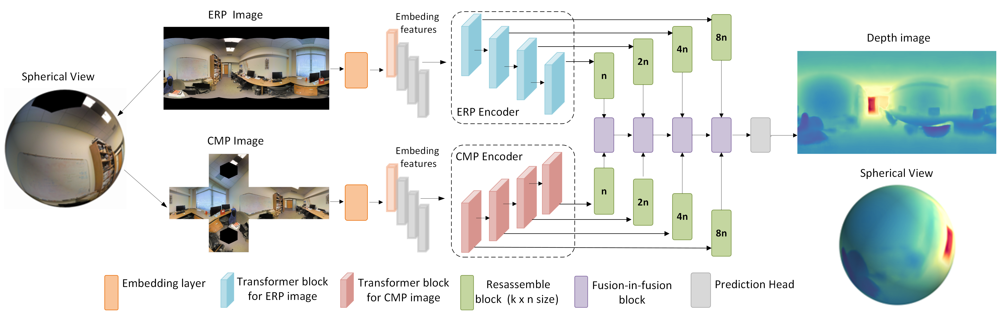

# FuseDPT: Multi-scale and Multi-Projection Model for Learning Depth in 360 Degree

## Cite the ICPR 2026 publication

Matheus Paula, Nevrez Imamoglu, Guillaume Caron, Antoine André. "*FuseDPT: Multi-scale and Multi-Projection Model for Learning Depth in 360 Degree*," **International Conference on Pattern Recognition (ICPR)**, IAPR, Aug 2026, Lyon, France.

### Model Architecture

<div align="center">
    
</div>
<p align="center">
  <em>Figure 1. Overview of the FuseDPT framework.</em>
</p>

### Article

https://hal.science/hal-05583714

## Usage

Run the already trained model with scripts like run.py

## Acknowledgements

This work is inspired and builds upon:

- Depth Anything V2 (Apache-2.0)
- UniFuse (MIT)

DPT architecture of Depth Anything v2 and Some components of the Unifuse such as CEE module are used from their implementation. We thank the original authors for releasing their code.

## Acknowledgements

This work builds upon the following open-source projects:

- **Depth Anything V2** ([GitHub](https://github.com/DepthAnything/Depth-Anything-V2)), licensed under Apache License 2.0.
- **UniFuse: Unidirectional Fusion for 360° Panoramic Depth Estimation** ([GitHub](https://github.com/alibaba/UniFuse-Unidirectional-Fusion)), licensed under the MIT License.

DPT architecture of Depth Anything v2 and some components of the Unifuse such as CEE module are based on these two works. We thank the original authors for releasing their code.

## Citation

If you use this code in your research, please cite:
**Paper:** [FuseDPT](https://link.springer.com/chapter/10.1007/978-3-032-31666-0_23)

```bibtex
@inproceedings{fuseDPT2026,
  author     = {Matheus Paula and Nevrez Imamoglu and Guillaume Caron and Antoine André},
  title      = {FuseDPT: Multi-scale and Multi-Projection Model for Learning Depth in 360 Degree},
  booktitle  = {International Conference on Pattern Recognition (ICPR)},
  publisher  = {Springer Nature Switzerland},
  pages      = {344--359},
  address    = {Lyon, France},
  doi        = "10.1007/978-3-032-31666-0\{_23}"
  year       = {2026}
}
```

## License

This project is released under the Apache License 2.0.

Portions of the codebase are derived from the UniFuse project and remain subject to the original MIT License terms and copyright notices where applicable.

